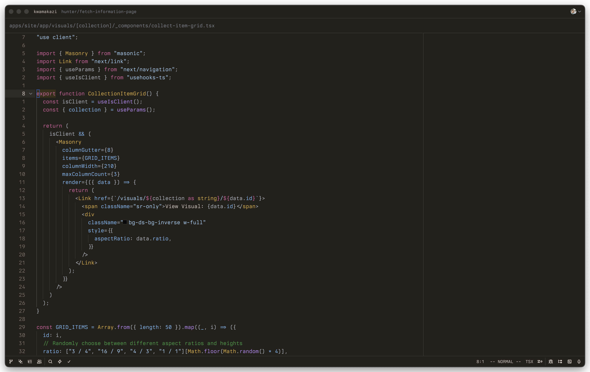
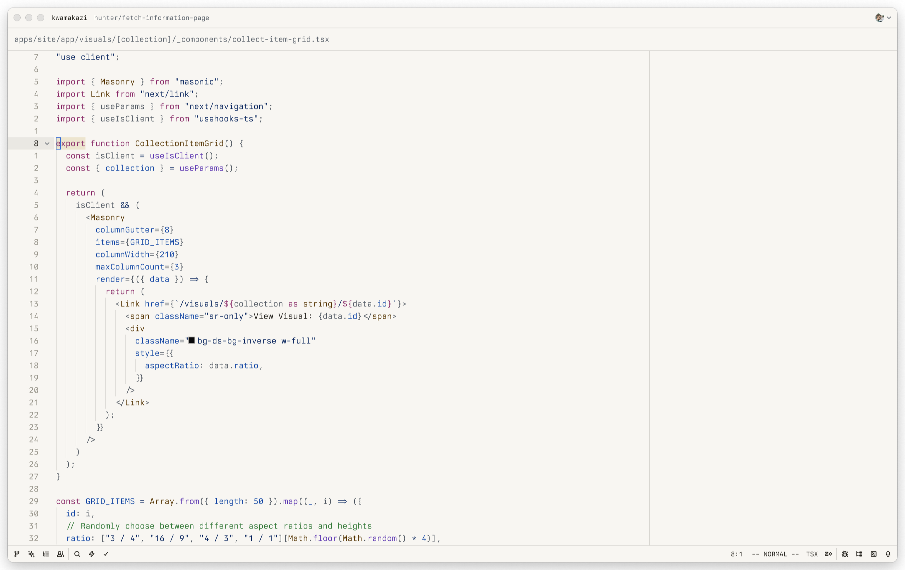

# Nushu Theme for Zed Editor

This project ports the Nushu theme to the Zed Editor.

## Nushu Dark

## Nushu Light

## About

From the original [repo](https://github.com/wheredoesyourmindgo/nushu-vscode-theme):

> Nushu (this theme) is a fork of the VSCode GitHub theme, specifically the GitHub Light Default and GitHub Dark Default themes. This theme uses alternative background colors that effectively reduce overall contrast. It uses the same Primer palette as the GitHub Default themes for syntax, so both the Light and Dark variants should seem "familiar".

Contributions are welcome! If you find any issues or have suggestions for improvements, please open an issue or submit a pull request. This project is licensed under the MIT License. See the LICENSE file for details.

## Installation

### From Zed's Extension Panel

1. Open Zed
2. Open the Extensions panel
3. Search for "Nushu"
4. Click Install

### Manual Installation

1. Clone the repository: `git clone https://github.com/h-jennings/nushu-zed-theme.git`
2. Open Zed
3. Open the Extensions panel
4. Click "Install Dev Extension"
5. Select the cloned repository directory

## Attribution

Special thanks to [wheredoesyourmindgo](https://github.com/wheredoesyourmindgo) for the original [Nushu theme](https://github.com/wheredoesyourmindgo/nushu-vscode-theme).
